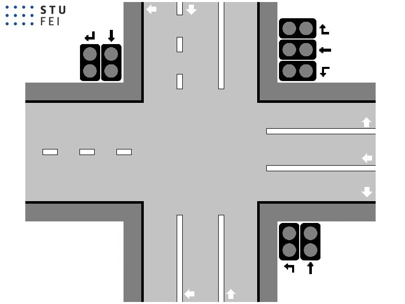

# UMINT — Zadanie č. 9: Fuzzy riadenie križovatky

> Porovnanie pevného a fuzzy riadenia semaforov na križovatke FEI–ZOO so 7 jazdnými pruhmi

---

## 1. Opis úlohy

Cieľom úlohy je navrhnúť riadenie križovatky pomocou fuzzy logiky a porovnať ho s pevným riadením pomocou fixných časových intervalov. Križovatka má **7 vstupných jazdných pruhov** rozdelených do troch smerov: **A** (pruhy A1, A2, A3), **B** (B1, B2) a **C** (C1, C2).

<p align="center">
  
</p>

### Konfigurácie semaforov

Riadenie sa realizuje cyklickým prepínaním troch konfigurácií:

| Konfigurácia | Zelená | Červená |
|:---:|:---:|:---:|
| 1 | A1, A2, A3 | B1, B2, C1, C2 |
| 2 | B1, B2, C2 | A1, A2, A3, C1 |
| 3 | B2, C1, C2 | A1, A2, A3, B1 |

### Režimy testovania

| Režim | Popis | Kroky |
|:---:|---|:---:|
| 3 | Dopravná špička zo smeru C | 150 |
| 4 | Dopravná špička zo smeru B | 150 |
| 5 | Dopravná špička zo smeru A | 150 |
| 6 | Kombinovaná dopravná špička | 500 |

---

## 2. Pevné riadenie

Dĺžky všetkých troch konfigurácií nastavené rovnako: `intervaly = [10 10 10]`

```matlab
vlastne_intervaly = 1
fuzzy_volba = 0
intervaly = [10 10 10]
```

### Režim 3 — Špička smer C
> Koniec: **17** | Max: **25**


### Režim 4 — Špička smer B
> Koniec: **18** | Max: **27**


### Režim 5 — Špička smer A
> Koniec: **38** ⚠️ | Max: **39** ⚠️


### Režim 6 — Kombinovaná špička
> Koniec: **57** ⚠️ | Max: **60** ⚠️


---

## 3. Návrh fuzzy systému

Fuzzy systém typu **Mamdani** s defuzzifikáciou metódou **centroidu**. Obsahuje 2 vstupné premenné, 1 výstupnú premennú a 9 pravidiel.

```matlab
fuzzy_volba = 1
vlastne_intervaly = 0
fuzzy_meno = 'kllemo_fuzzy.fis'
```

### Vstupné a výstupné premenné

| Premenná | Rozsah | Fuzzy množiny |
|---|:---:|---|
| **Vstup 1** — Počet áut na zelenej | [0 – 100] | Malo (trapmf), Stredne (trimf), Veľa (trapmf) |
| **Vstup 2** — Počet áut na červenej | [0 – 150] | Malo (trapmf), Stredne (trimf), Veľa (trapmf) |
| **Výstup** — Doba trvania zelenej | [5 – 30] | Krátko (trimf), Normálne (trimf), Dlho (trapmf) |

### Funkcie príslušnosti

**Vstup 1 — Počet áut na zelenej [0–100]:**
- Malo: trapmf `[-1, -1, 0, 8]`
- Stredne: trimf `[4, 12, 22]`
- Veľa: trapmf `[16, 28, 100, 100]`

**Vstup 2 — Počet áut na červenej [0–150]:**
- Malo: trapmf `[-1, -1, 3, 15]`
- Stredne: trimf `[8, 25, 45]`
- Veľa: trapmf `[30, 55, 150, 150]`

**Výstup — Doba trvania zelenej [5–30]:**
- Krátko: trimf `[5, 5, 12]`
- Normálne: trimf `[10, 18, 25]`
- Dlho: trapmf `[20, 28, 30, 30]`

### Pravidlá (9 pravidiel — plné pokrytie 3×3)

| | Červená = Malo | Červená = Stredne | Červená = Veľa |
|:---|:---:|:---:|:---:|
| **Zelená = Malo** | Normálne | Krátko | Krátko |
| **Zelená = Stredne** | Normálne | Normálne | Krátko |
| **Zelená = Veľa** | Dlho | Dlho | Normálne |

### Princíp fungovania

Fuzzy systém dynamicky prispôsobuje dobu trvania zelenej aktuálnej situácii na križovatke:

- **Veľa áut na červenej + málo na zelenej** → rýchle prepnutie (Krátko, 5–12 krokov)
- **Veľa áut na zelenej + málo na červenej** → dlhšia zelená (Dlho, 20–30 krokov)
- **Vyrovnaný stav** → stredná doba (Normálne, 10–25 krokov)

Kľúčové zistenie pri ladení: minimálna doba zelenej musí byť aspoň **5 krokov**, pretože vodič v simulácii potrebuje 3 kroky na reakciu a odchod. Príliš krátke intervaly spôsobia, že žiadne auto neodíde a križovatka sa zablokuje.

---

## 4. Výsledky fuzzy riadenia

### Režim 3 — Špička smer C
> Koniec: **10** ✅ | Max: **21** ✅


### Režim 4 — Špička smer B
> Koniec: **7** ✅ | Max: **20** ✅


### Režim 5 — Špička smer A
> Koniec: **8** ✅ | Max: **23** ✅


### Režim 6 — Kombinovaná špička
> Koniec: **9** ✅ | Max: **33** ✅


---

## 5. Porovnanie výsledkov

| Režim | Pevné — koniec | Pevné — max | Fuzzy — koniec | Fuzzy — max | Zlepšenie |
|:---:|:---:|:---:|:---:|:---:|:---:|
| 3 (špička C) | 17 | 25 | **10** ✅ | **21** ✅ | −41 % |
| 4 (špička B) | 18 | 27 | **7** ✅ | **20** ✅ | −61 % |
| 5 (špička A) | 38 ⚠️ | 39 ⚠️ | **8** ✅ | **23** ✅ | −79 % |
| 6 (kombinácia) | 57 ⚠️ | 60 ⚠️ | **9** ✅ | **33** ✅ | −84 % |

### Splnenie limitov — Režim 6 (fuzzy)

| Kritérium | Limit | Výsledok | Stav |
|---|:---:|:---:|:---:|
| Max áut v pruhoch | ≤ 10 | ≤ 10 | ✅ |
| Max áut v pruhu A2 | ≤ 15 | ≤ 14 | ✅ |
| Max celkový počet áut | ≤ 40 | 33 | ✅ |
| Počet áut na konci scenára | < 20 | 9 | ✅ |

---

## 6. Diskusia

Fuzzy riadenie dosiahlo **výrazne lepšie výsledky** vo všetkých testovaných režimoch. Najväčší rozdiel je viditeľný v režimoch 5 a 6, kde pevné riadenie nedokázalo zvládnuť dopravné špičky — počet áut neustále narastal a na konci scenára bolo 38 resp. 57 áut. Fuzzy riadenie tieto scenáre zvládlo s koncovým počtom 8 resp. 9 áut.

**Hlavná výhoda fuzzy prístupu** spočíva v jeho schopnosti dynamicky reagovať na aktuálnu dopravnú situáciu. Keď sa na červenej nahromadí veľa áut, fuzzy systém skráti zelenú a rýchlejšie prepne konfiguráciu. Naopak, keď je na zelenej veľa áut a na červenej málo, systém ponechá zelenú dlhšie, aby sa stihli odbaviť.

**Kľúčové zistenie pri ladení:** rozsah výstupnej premennej je kritický parameter. Príliš krátke intervaly (pod 3 kroky) sú kontraproduktívne — vodič v simulácii má reakčný čas 3 kroky, takže pri veľmi krátkej zelenej žiadne auto neodíde. Optimálny rozsah bol 5–30 krokov, kde sa fuzzy systém pohyboval väčšinou okolo 12–18 krokov podľa situácie.

**Pevné riadenie** je obmedzené tým, že nemá žiadnu spätnú väzbu — ignoruje aktuálny stav križovatky. Pri rovnomernej premávke funguje prijateľne (režim 3: 17 áut na konci), ale pri silných špičkách z jedného smeru úplne zlyháva (režim 5: 38 áut, režim 6: 57 áut).

---

*UMINT 2026 — Laboratórne cvičenie č. 9 — Fuzzy logika — STU FEI*
